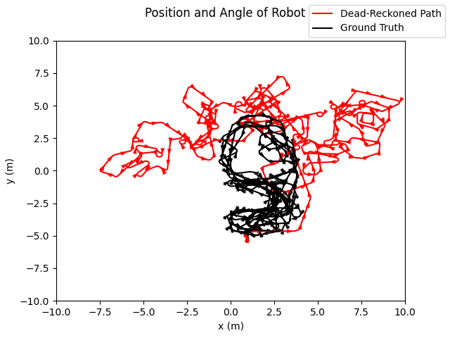
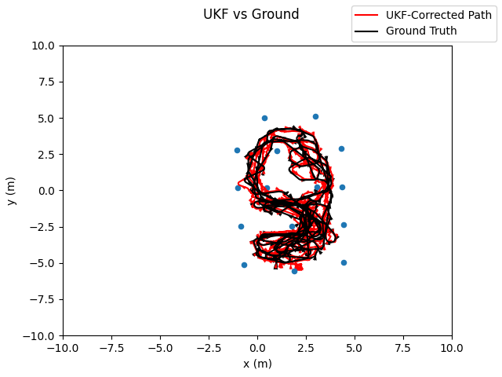

# UKF — Unscented Kalman Filter State Estimation

## Goal

Estimate a robot’s state (e.g., position and heading) in the presence of nonlinear dynamics and noisy measurements using an **Unscented Kalman Filter (UKF)**.

---

## Key Takeaways

- Demonstrates nonlinear state estimation using sigma points instead of local linearization
- Highlights the sensitivity of filter performance to noise tuning
- Shows stable convergence after proper tuning of process and measurement covariances

---

## Filter Behavior Progression

Below is the progression from an **initial, poorly tuned UKF** to a **well-tuned filter**:

  
  &#8594;
  

**Left:** Initial UKF prediction with poor noise tuning  
**Right:** Tuned UKF with stable convergence and accurate tracking

---

## Design Decisions

- UKF chosen over EKF to avoid linearization errors in nonlinear motion models
- Full covariance matrices used for flexibility
- Angle wrapping handled explicitly to preserve consistency
- Covariance regularization applied to maintain numerical stability

---

## Outputs

Typical outputs include:
- Estimated vs. reference trajectory
- State error over time
- Covariance or confidence bounds

---

## How to Run

See `src/` for the main entry script and configuration parameters.
